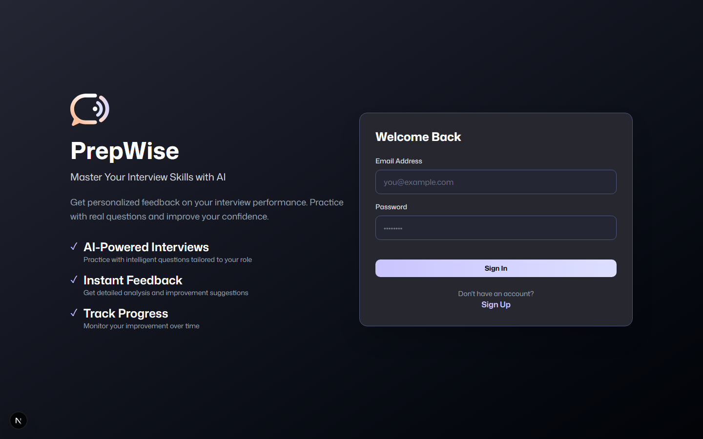
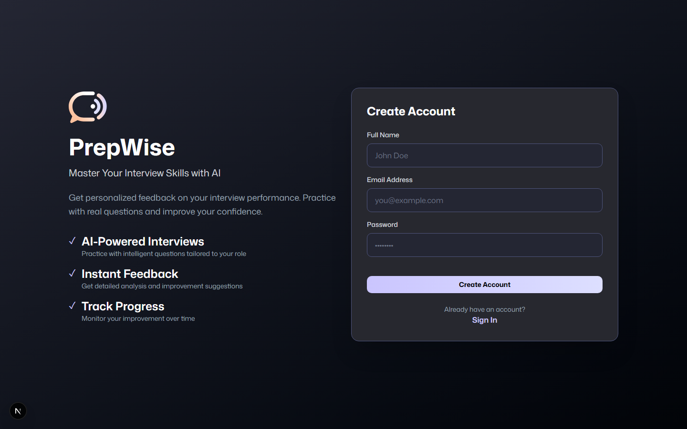
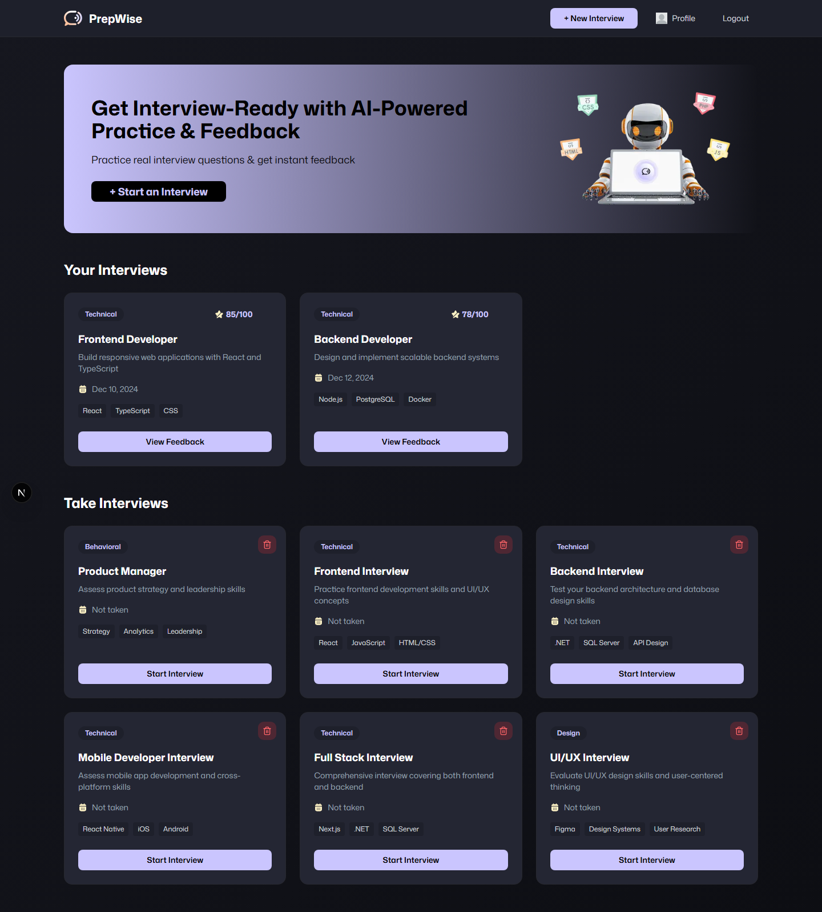
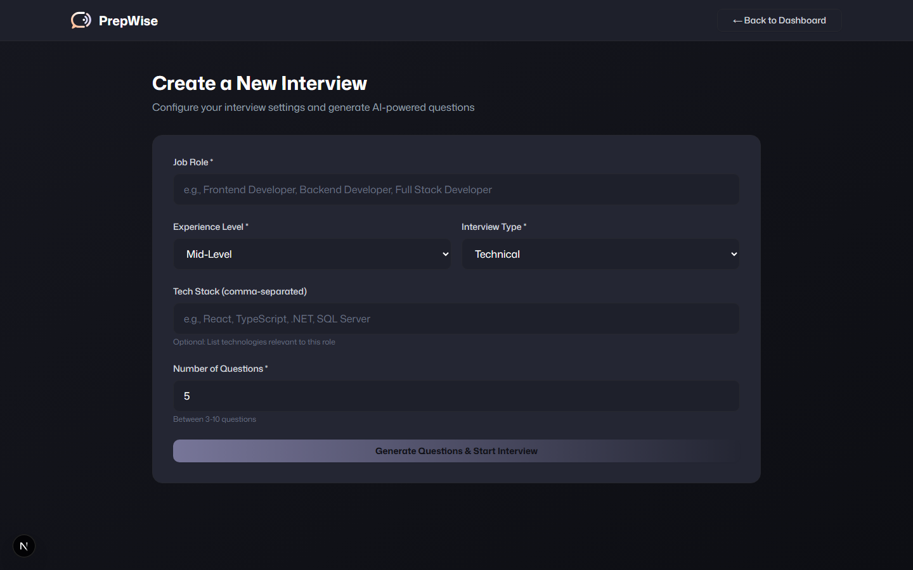
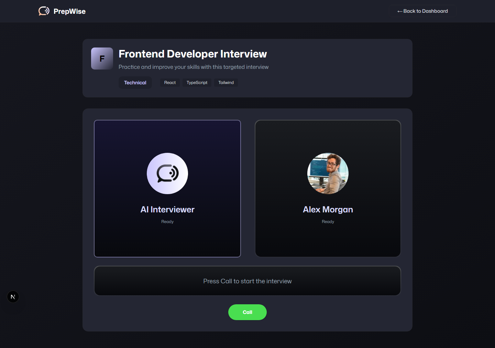
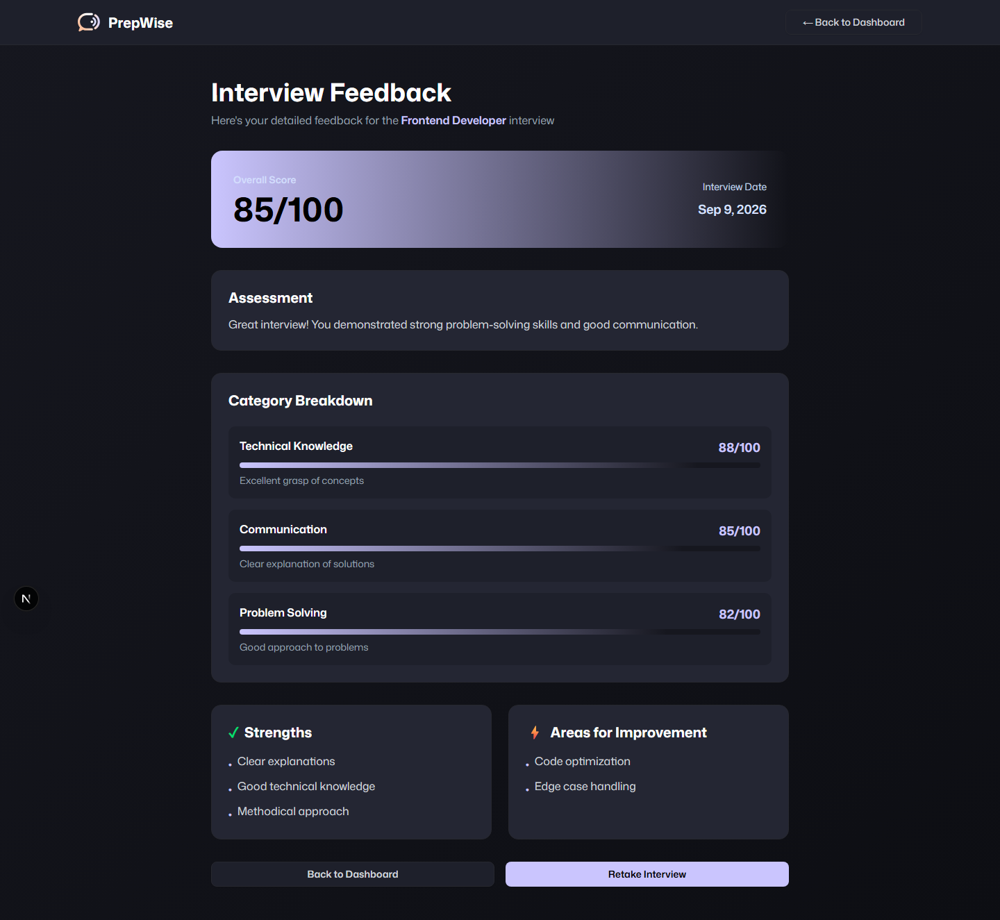
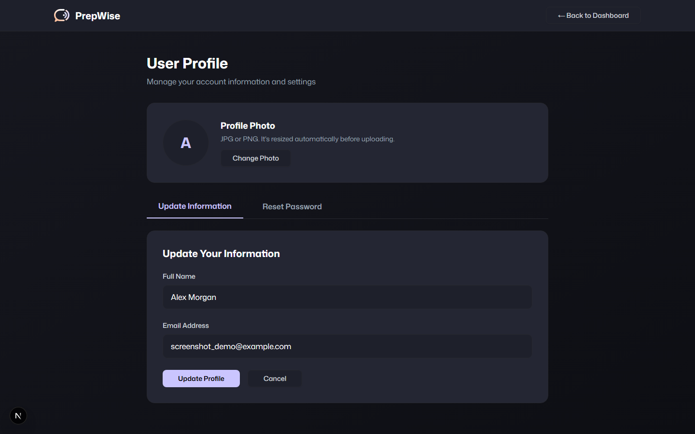

# PrepWise | AI-Driven Mock Interview Platform

PrepWise is an interview simulation platform that combines **voice-first conversational AI** with a full-stack **Next.js + ASP.NET Core** architecture to help candidates practice technical and behavioral interviews and get structured feedback afterward.

The platform demonstrates the intersection of **Real-time Voice AI**, **LLM-driven question generation**, and a **decoupled full-stack service layer** (TypeScript frontend, C# backend).

---

## 🚀 Live Demo

- **Frontend** (Vercel): [ai-mock-interview-system-prep-wise.vercel.app](https://ai-mock-interview-system-prep-wise.vercel.app/)
- **Backend API** (Render): [ai-mock-interview-system-prepwise.onrender.com](https://ai-mock-interview-system-prepwise.onrender.com/) — interactive Swagger docs at `/swagger`

> The backend runs on Render's free tier, which spins down after 15 minutes of inactivity. The first request after a quiet period can take 30-50 seconds to wake back up — that's expected, not a bug.

---

## 📸 Screenshots

| Sign In | Sign Up |
| :---: | :---: |
|  |  |

| Dashboard |
| :---: |
|  |

| Create Interview | Live Call |
| :---: | :---: |
|  |  |

| Feedback | Profile |
| :---: | :---: |
|  |  |

---

## 🏛️ Key Engineering Pieces

### 1. Real-time Voice Interviewing
The interview session runs through the **Vapi AI Web SDK** (`@vapi-ai/web`), which drives the live voice assistant — handling Speech-to-Text and Text-to-Speech banking so the candidate has a natural, spoken back-and-forth instead of typing answers.

### 2. LLM-Generated Interview Questions
Interview questions are generated on demand via a Next.js API route (`app/api/generate-questions`) that calls **Google's Gemini** model (`@ai-sdk/google` + `ai` SDK) with the candidate's chosen role, seniority level, tech stack, and question focus (behavioral vs. technical), returning a clean JSON array of questions safe for the voice assistant to read aloud.

### 3. Decoupled Auth & Profile API
Authentication, profile management, and password reset are served by a dedicated **ASP.NET Core 8** Web API (`backend/`), using **Dapper** for lightweight data access, **BCrypt.Net** for password hashing, and **SQLite** as the default local database provider (with a SQL Server connection string available for production use).

---

## 🔄 Interview Flow

1. **Setup** — candidate picks a role, experience level, tech stack, and interview focus (`frontend/components/interview/InterviewForm.tsx`).
2. **Live Session** — the Vapi-powered agent (`frontend/components/interview/Agent.tsx`) asks the generated questions out loud and listens to spoken responses.
3. **Feedback** — after the call ends, the candidate is routed to a feedback page (`app/(root)/interview/[id]/feedback`) summarizing performance.
4. **Dashboard & Profile** — past interviews and account details are available from the dashboard and profile pages.

---

## 🛠️ Tech Stack

| Layer | Technology | Notes |
| :--- | :--- | :--- |
| **Frontend** | Next.js 15, React 19, TypeScript | App Router, Tailwind CSS for styling |
| **Voice AI** | Vapi AI Web SDK | Real-time speech-to-text / text-to-speech |
| **Question Generation** | Google Gemini (`@ai-sdk/google`, `ai`) | LLM prompt-driven question generation |
| **Backend API** | ASP.NET Core 8 | Auth, profile, and password-reset endpoints |
| **Data Access** | Dapper + Microsoft.Data.Sqlite | SQLite by default; `Microsoft.Data.SqlClient` available for SQL Server |
| **Security** | BCrypt.Net-Next | Password hashing |
| **API Docs** | Swashbuckle (Swagger) | Auto-generated API docs at `/swagger` |

---

## 📋 Prerequisites

- **.NET 8.0 SDK** — for the backend API
- **Node.js 18+** — for the frontend
- **npm** (or yarn/pnpm) — package manager
- A **Google Generative AI API key** (for question generation) and **Vapi** credentials (for the voice agent)

## 🚀 Quick Start

### 1. Backend (ASP.NET Core)

```bash
cd backend
dotnet restore
dotnet run
```

Backend runs on `http://localhost:5216` by default. Uses **SQLite** locally (`backend/appsettings.json` → `DatabaseProvider: "Sqlite"`); a SQL Server connection string is also configured for production use.

### 2. Frontend (Next.js)

```bash
npm install
npm run dev
```

Frontend runs on `http://localhost:3000` (or `3001` if 3000 is taken). Add a `.env.local` with your `GOOGLE_GENERATIVE_AI_API_KEY` and Vapi keys before starting a live interview session.

---

## 📁 Repository Structure

```text
sami.AI/
├── app/                        # Next.js App Router
│   ├── (auth)/                 # Sign-in / sign-up
│   ├── (root)/                 # Dashboard, interview, feedback, profile
│   └── api/generate-questions/ # Gemini-powered question generation route
├── frontend/
│   └── components/
│       ├── auth/                # Auth form
│       ├── common/               # Shared UI (cards, form fields, tech icons, dialogs)
│       ├── interview/            # Interview form + live voice Agent
│       └── ui/                   # Base UI primitives (button, form, input, etc.)
├── backend/                    # ASP.NET Core Web API
│   ├── Program.cs               # Minimal API endpoints (auth/profile routes), DI, middleware
│   ├── Models/                  # DTOs (Login, Register, ResetPassword, UpdateProfile, UpdatePhoto, User)
│   ├── Services/                # IUserService / UserService business logic
│   └── Dockerfile                # Container build used for the Render deployment
└── shared/                     # Cross-cutting constants, types, and utils
```

---

## 🔐 API Endpoints

Base route: `/auth` (implemented as ASP.NET Core Minimal APIs directly in `Program.cs`)

- `POST /auth/register` — Register a new user
- `POST /auth/login` — Authenticate a user
- `GET /auth/profile/{userId}` — Get user profile
- `PUT /auth/profile/{userId}` — Update user profile (name/email)
- `PUT /auth/profile/{userId}/photo` — Update profile photo (base64 image data URL)
- `POST /auth/reset-password` — Reset password

Full interactive API docs are available at `/swagger` — locally at `http://localhost:5216/swagger`, or on the [live backend](https://ai-mock-interview-system-prepwise.onrender.com/swagger).

---

## ☁️ Deployment

- **Frontend** is deployed on **Vercel**, built directly from this repo's `main` branch (root directory `./`, zero extra config — Vercel auto-detects Next.js).
- **Backend** is deployed on **Render** as a Docker web service, using the `backend/Dockerfile` and `render.yaml` blueprint in this repo. It runs on SQLite with `DatabaseProvider=Sqlite`.
- The two are connected via environment variables:
  - Frontend: `NEXT_PUBLIC_API_BASE_URL` points at the Render backend URL.
  - Backend: `AllowedOrigins` (comma-separated) includes the Vercel frontend URL, so CORS allows the browser to call it.

⚠️ Render's free tier has an **ephemeral filesystem** — the SQLite database resets on every redeploy/restart. Fine for a demo; for persistent user data in production, point `DatabaseProvider` at a hosted Postgres/SQL Server instead (the backend already references `Microsoft.Data.SqlClient`).

---

## 📝 License

This project is for educational purposes.

---
**Developed by [Sami Shahid](https://github.com/samishahid516)**
